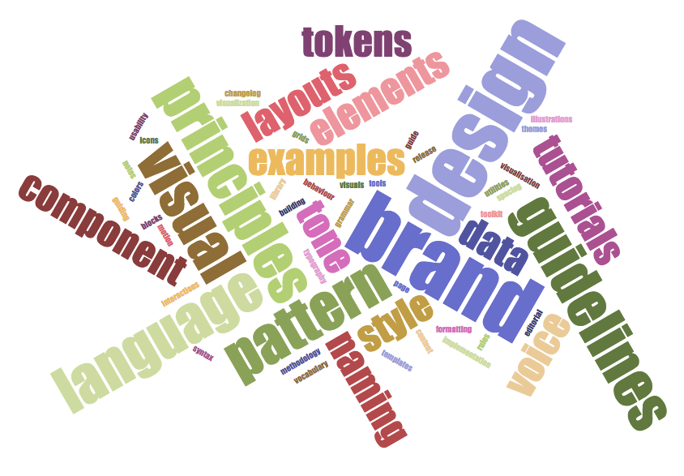

import ProjectRoles from '../../../../src/components/ProjectRoles'

Let's start with a story.

<i>

Recently, I was talking about design systems infrastructure at the awesome React Finland conference. The day before the
conference, there was a traditional dinner for speakers. I like this tradition as it makes possible for us speakers to
meet our fellows and the conference organizers so that the next days we work as a team to provide the very best event. As
usual, we were asking each other what the talks are about. When it was my turn, I started to explain that my talk is
going to be about building infrastructure for a design system and particularly a design system website. One person
interrupted me with a question "A style guide?". And that is the key issue. Many people think that **design systems**
are
equal to **style guides**. But they are much more, they must be much more. On this page, I show what is a design system from
different perspectives: design, development, project and even business.

</i>

## What is a design system for me?

We can have a look at who are the actual or potential users of design systems, and what are their professional needs in
this context.

<ProjectRoles role="developer" side="left"/>
Design systems are often understood as libraries of components. In this regard, the developers are seeing the system
mostly from this perspective. Developers would like to have documentation for every component, examples of usage and
maybe explanation of the implementation details. Apart from that, they would need information related to the whole
system. Such as release notes, instructions for linking the library to the project, etc. For contribution, they need to
know what is the library code style and contribution policy. To give feedback, they need the contact information of the design system team and/or access to relevant boards or chats.
